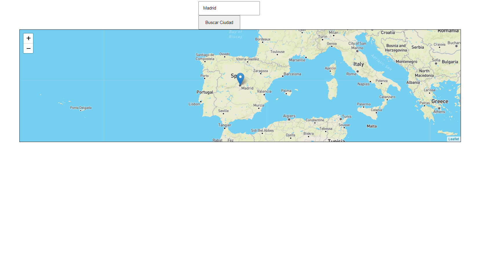

# [Bootcamp Web Developer Full Stack](https://www.thebridge.tech/bootcamps/bootcamp-fullstack-developer/)

### HTML, CSS,  JS, ES6, Node.js, Frontend, Backend, Express, React, MERN, testing, DevOps

# API HTML5: Geolocalización - Mapas


 

La API de geolocalización permite al usuario compartir su ubicación a las aplicaciones web si así lo desea. Por razones de privacidad, al usuario se le pide que confirme el permiso para proporcionar información de ubicación.

- [MDN | Using Geolocation](https://developer.mozilla.org/es/docs/WebAPI/Using_geolocation)
- [Demo - geolocation](https://www.w3schools.com/html/html5_geolocation.asp)

Obtener ubicación actual

```javascript
if ("geolocation" in navigator) {
  navigator.geolocation.getCurrentPosition((position) => {
    console.log(
      `Latitud: ${position.coords.latitude}\nLongitud: ${position.coords.longitude}`
    );
    let datos = `<h1>Aquí estás!</h1>
        <p>Lat: ${position.coords.latitude.toFixed(4)}</p>
        <p>Long: ${position.coords.longitude.toFixed(4)}</p>`;
    document.body.innerHTML = datos;
  });
} else {
  console.warn("Tu navegador no soporta Geolocalización!! ");
}
```

 

### Leaflet

Vamos a probar una librería Open Source para dibujar mapas.

- [Leaflet](https://leafletjs.com/)

 

### Instrucciones para usar Leaflet

Entre todas las herramientas y librerias que tenemos en el frontend para pintar mapas, **Leaflet** es una librería Open Source que permite integrar gestores de mapas en sus funciones de pintado, convirtiéndola en una librería ideal para aprender a trabajar con mapas y conseguir excelentes resultados en nuestros proyectos.
**Pasos para integrar Leaflet**

1. Añadir link al CSS de Leaflet en `<head></head>` y script al final del `<body></body>`:

```html
<!-- Link Leaflet CSS -->
<link
  rel="stylesheet"
  href="https://unpkg.com/leaflet@1.7.1/dist/leaflet.css"
  integrity="sha512-xodZBNTC5n17Xt2atTPuE1HxjVMSvLVW9ocqUKLsCC5CXdbqCmblAshOMAS6/keqq/sMZMZ19scR4PsZChSR7A=="
  crossorigin=""
/>
<!-- Script Leaflet JS -->
<script
  src="https://unpkg.com/leaflet@1.7.1/dist/leaflet.js"
  integrity="sha512-XQoYMqMTK8LvdxXYG3nZ448hOEQiglfqkJs1NOQV44cWnUrBc8PkAOcXy20w0vlaXaVUearIOBhiXZ5V3ynxwA=="
  crossorigin=""
></script>
```

2. Crea un `div` que contenga un `id` única en el que inyectaremos el mapa.Además a modo de probar la funcionalidad del mapa vamos a crearnos otro div y un botón que dispare una función , que sirva para introducir una ciudad y buscarla en el mapa:

```html
	<section>

		<div class="searchMap">
			<input type="text" id="cityName">
			<button onclick="searchCity();">Buscar Ciudad</button>
		</div>
		<div id="map"></div>

	</section>
```

3. Dale estilos al `div` para que podamos verlo sin problemas en el navegador:

```css
 section {

    display: flex;
    justify-content: center;
    flex-direction: column;
    align-items: center;
}


#map {
    height: 40Vh;
    width: 80%;
    border: 1px solid black;
}

input , button{
    padding: 5%;
}
 

button {
    width: 50%;
}
```

4. Inyecta el mapa usando **Leaflet** a través del script que habíamos importado. Para ello crea un archivo `index.js` (o con el nombre que prefieras) y utiliza este código:

 ```javascript

const mapId = "map";                                       //* Id index del mapa
const initialCoordinates = [40.4169473, -3.7057172];       //* Cordenadas iniciales (Plaza Sol en Madrid [lat, lng])
const map = L.map(mapId).setView(initialCoordinates, 5);   //* const Map = (Nos inserta el mapa en el div "map").(Centrada en la cordenada inicial, Zoom = 5)

 ```

- Ahora verás que el mapa creado es gris y no somos capaces de ver su contenido. Esto se debe a que necesitamos usar una librería de `tiles`, es decir, las piezas que conforman el mapa tal y como lo conocemos.

5. Como librería de `tiles` a añadir, utilizaremos **Mapbox**.

- Crearemos para esto un string al que interpolaremos variables a través de una función de **Leaflet**:

```javascript
const MAPBOX_API =
  "https://api.mapbox.com/styles/v1/{id}/tiles/{z}/{x}/{y}?access_token={accessToken}";
```

- Ahora iremos a la web de **Mapbox** y nos registraremos para obtener una API key y añadiremos las siguientes variables:

```javascript
 // Este token será el que obtengamos en la web de Mapbox
const ACCESS_TOKEN =
  "pk.eyJ1IjoiY2Nhc3RpbGxvMDZtYiIsImEiOiJja2k1eXpybXU3em1mMnRsNjNqajJ0YW12In0.aFQJlFDBDQeUpLHT4EiRYg";
```

- Por último, lanzaremos la siguiente función de **Leaflet** para cargar todos los tiles de **Mapbox** en nuestro mapa:

```javascript
L.tileLayer(MAPBOX_API, {
  maxZoom: 18,
  id: "mapbox/streets-v11",
  tileSize: 512,
  zoomOffset: -1,
  accessToken: ACCESS_TOKEN,
}).addTo(map);
```

6. Ahora que vemos el mapa correctamente, vamos a crear una función para buscar una ciudad y que nos la muestre en el mapa

 ```javascript
function searchCity() {
  let city = document.getElementById("cityName").value.toLowerCase();
  fetch("./coordenatesspain.json")
    .then((res) => res.json())
    .then((res) => {
      let coordenatesCity = res.filter((cities) => cities.ciudad == city);
      //* Para gestionar un gran cambio del json.
      let cleanLat = coordenatesCity[0].latitud * 100;
      let cleanLon = coordenatesCity[0].longitud * 100;
      const plazaMayorCoordinates = [cleanLat, cleanLon];
      //* Añadir marcador de la ciudad solicitada en el div.
      L.marker(plazaMayorCoordinates).bindPopup(`${city} : lat:${cleanLat} long: ${cleanLon}`).addTo(map);
    });

 ```
 
 